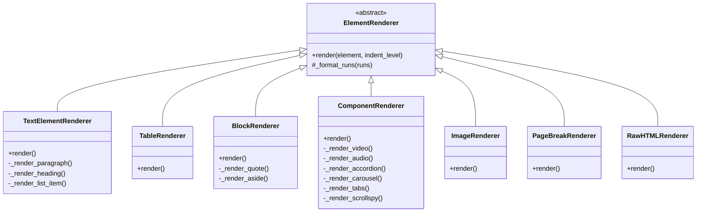

# Guide du générateur HTML

Ce guide détaille le fonctionnement du générateur HTML et explique comment l'utiliser et l'étendre.

## Table des matières

1. [Vue d'ensemble](#vue-densemble)
2. [Architecture détaillée](#architecture-détaillée)
3. [Renderers spécialisés](#renderers-spécialisés)
4. [Gestion des sauts de page](#gestion-des-sauts-de-page)
5. [Personnalisation du HTML](#personnalisation-du-html)
6. [Exemples d'utilisation](#exemples-dutilisation)
7. [Extension du système](#extension-du-système)

## Vue d'ensemble

Le générateur HTML est conçu pour transformer une structure JSON en HTML en utilisant une approche modulaire basée sur des renderers spécialisés. Cette architecture permet :

- Une séparation claire des responsabilités
- Une facilité d'extension pour de nouveaux types d'éléments
- Une maintenance simplifiée
- Une meilleure testabilité

## Architecture détaillée

### Structure des fichiers

```
html_renderer/
├── __init__.py         # Exports des classes
├── base.py            # Classe de base ElementRenderer
├── generator.py       # Classe principale HTMLGenerator
├── text.py           # Rendu des éléments textuels
├── table.py          # Rendu des tableaux
├── block.py          # Rendu des blocs (citations, etc.)
├── component.py      # Rendu des composants interactifs
├── image.py          # Rendu des images
├── page_break.py     # Rendu des sauts de page
└── raw_html.py       # Rendu du HTML brut
```

### Flux de génération

1. Le `HTMLGenerator` reçoit les données JSON du document
2. Il initialise les différents renderers spécialisés
3. Pour chaque élément du document :
   - Il identifie le type d'élément
   - Il délègue le rendu au renderer approprié
   - Il collecte et assemble le HTML généré
4. Il encapsule le contenu dans une structure HTML complète

### Hiérarchie des classes



## Renderers spécialisés

### TextElementRenderer

Gère trois types d'éléments textuels :
- Paragraphes (`<p>`)
- Titres (`<h1>` à `<h6>`)
- Éléments de liste (`<li>`)

Fonctionnalités :
- Formatage du texte (gras, italique, souligné)
- Support des classes et IDs HTML
- Filtrage des éléments vides

### TableRenderer

Génère des tableaux HTML avec :
- Structure Bootstrap
- Support des cellules multi-paragraphes
- Indentation correcte
- Filtrage des tables vides

### BlockRenderer

Gère les blocs spéciaux :
- Citations (`<blockquote>`)
- Encadrés (`<aside>`)
- Support du contenu imbriqué
- Styles Bootstrap

### ComponentRenderer

Implémente des composants interactifs complexes :

1. **Vidéo**
   - Ratio 16:9
   - Support des iframes
   - Description optionnelle

2. **Audio**
   - Contrôles de lecture
   - Support de multiples formats
   - Description optionnelle

3. **Accordéon**
   - Sections pliables/dépliables
   - Titres et contenus dynamiques
   - Styles Bootstrap

4. **Carrousel**
   - Navigation entre diapositives
   - Contrôles précédent/suivant
   - Support des images et du texte

5. **Onglets**
   - Navigation par onglets
   - Contenu dynamique
   - Accessibilité ARIA

6. **Défilement (Scrollspy)**
   - Navigation latérale
   - Suivi de la position
   - Mise en évidence automatique

## Gestion des sauts de page

Le système offre deux approches pour gérer les sauts de page :

### 1. Fichier unique avec sauts de page CSS

```python
generator = HTMLGenerator(json_data)
html = generator.generate(custom_css)
```

- Utilise `@media print` pour les sauts de page
- Idéal pour l'impression
- Maintient la navigation fluide

### 2. Fichiers HTML séparés

```python
generator = HTMLGenerator(json_data)
files = generator.generate_multi_page(output_dir, base_filename, custom_css)
```

- Crée un fichier par section
- Navigation entre fichiers
- Meilleur pour certains cas d'utilisation

## Personnalisation du HTML

### CSS personnalisé

```python
# Utiliser un fichier CSS externe
with open("style.css") as f:
    custom_css = f.read()
html = generator.generate(custom_css)

# Ou désactiver Bootstrap
html = generator.generate("")
```

### Classes et IDs HTML

Les éléments peuvent inclure des classes et IDs :
```json
{
    "type": "paragraph",
    "html_class": "important highlight",
    "html_id": "intro",
    "runs": [...]
}
```

## Exemples d'utilisation

### Génération simple

```python
from docx_json.core.html_renderer import HTMLGenerator

# Créer le générateur
generator = HTMLGenerator(json_data)

# Générer le HTML
html = generator.generate()

# Sauvegarder
with open("output.html", "w", encoding="utf-8") as f:
    f.write(html)
```

### Génération multi-pages

```python
# Générer plusieurs fichiers
files = generator.generate_multi_page(
    output_dir="output",
    base_filename="document",
    custom_css=custom_css
)

# Les fichiers générés seront :
# - output/document.html
# - output/document_1.html
# - output/document_2.html
# etc.
```

### Utilisation en ligne de commande

```bash
# Génération simple
python -m docx_json document.docx --html

# Avec sauts de page
python -m docx_json document.docx --html --multipage

# Avec CSS personnalisé
python -m docx_json document.docx --html --css style.css
```

## Extension du système

### Création d'un nouveau renderer

1. Créer une nouvelle classe héritant de `ElementRenderer`
2. Implémenter la méthode `render()`
3. Ajouter le renderer au `HTMLGenerator`

Exemple pour un renderer de code source :

```python
# code_renderer.py
from typing import Any, Dict, List
from .base import ElementRenderer

class CodeRenderer(ElementRenderer):
    def render(self, element: Dict[str, Any], indent_level: int = 0) -> List[str]:
        indent = " " * indent_level
        language = element.get("language", "")
        code = element.get("code", "")

        return [
            f'{indent}<pre>',
            f'{indent}  <code class="language-{language}">',
            f'{indent}    {code}',
            f'{indent}  </code>',
            f'{indent}</pre>'
        ]

# Dans generator.py
from .code_renderer import CodeRenderer

class HTMLGenerator:
    def __init__(self, json_data):
        # ...
        self._code_renderer = CodeRenderer()
        self._renderers["code"] = self._code_renderer
```

### Personnalisation des renderers existants

Pour modifier le comportement d'un renderer :

1. Créer une sous-classe du renderer existant
2. Surcharger les méthodes nécessaires
3. Utiliser la nouvelle classe dans le générateur

Exemple :

```python
class CustomTableRenderer(TableRenderer):
    def render(self, element: Dict[str, Any], indent_level: int = 0) -> List[str]:
        # Personnaliser le rendu des tableaux
        indent = " " * indent_level
        return [
            f'{indent}<div class="table-responsive">',
            *super().render(element, indent_level + 2),
            f"{indent}</div>"
        ]

# Utilisation
generator = HTMLGenerator(json_data)
generator._table_renderer = CustomTableRenderer(generator)
```

### Ajout de fonctionnalités globales

Pour ajouter des fonctionnalités qui affectent tous les renderers :

1. Étendre la classe `ElementRenderer`
2. Mettre à jour tous les renderers existants
3. Mettre à jour le `HTMLGenerator`

Exemple pour ajouter le support des attributs de données :

```python
class ElementRenderer(ABC):
    def _format_attributes(self, element: Dict[str, Any]) -> str:
        attrs = []
        # Classes et IDs existants
        if "html_class" in element:
            attrs.append(f'class="{element["html_class"]}"')
        if "html_id" in element:
            attrs.append(f'id="{element["html_id"]}"')
        # Nouveaux attributs de données
        for key, value in element.get("data", {}).items():
            attrs.append(f'data-{key}="{value}"')
        return " " + " ".join(attrs) if attrs else ""
```